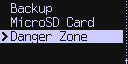

title: Advanced Menu
ordering: 80

## Background

The advanced menu contains a number of useful features that are not required daily.

{.snap .indented}


## Advanced Functions

View Identity
: Display a few public details about your wallet, such as the XPUB and the fingerprint.

[Upgrade](upgrade)
: Upgrade the firmware on the Coldcard, using MicroSD. Also shows version numbers.

[Backup](backups)
: Save your wallet seed and settings into an encrypted MicroSD file.

[MicroSD Card](microsd)
: Manage files on the MicroSD card, and other functions related to the card.

[Paper Wallets](#paper-wallets)
: Create a paper Bitcoin wallet.

Address Explorer
: View payment addresses, and optionally save them to a MicroSD card.

Danger Zone
: Developer-only features and things you shouldn't do.


## "Danger Zone" Menu

The advanced menu contains a sub menu labeled the "Danger Zone":

{.snap .indented}

These are rarely-used commands that have the potential to affect your Bitcoin holdings.
Use them with caution.

Debug Functions
: Test some error cases, such as exceptions. Mostly harmless.

Lock Down Seed
: [Convert BIP39 seed phrase and password to a BIP32 wallet.](passphrase#related-feature-lock-down-seed)

View Seed Words
: Shows warning screen, and then displays the 24 seed words on the
  Coldcard screen. If defined, the [BIP39 passphrase](passphrase) is also shown.

Destroy Seed
: Forget the seed words, and all hope of recovering your funds! There is a confirmation screen.

I Am Developer
: Enable various debuging modes and features for MicroPython programmers and experimentors.

Wipe Patch Area
: Wipe and rebuild a small internal filesystem that can be used to store extra code/features. Harmless.

Perform Seltest
: Starts the factory self-test, which will clear the settings.

Set High-Water
: Records a new minimum version number for future upgrades and prevents downgrades below current version.


## Paper Wallets

This feature creates a new random private key, completely unrelated
to your seed words, and saves deposit address and private key (WIF
format) into a text file on MicroSD. That file is a ready to use
paper wallet!

You may also use your dice rolls as an entropy source instead of the Coldcard's TRNG
(true random number generator).

If you have a Mk3, it will also add a QR code inside the text file, and if you provide a 
special PDF-like template file
(example in [paperwallet.pdf](https://github.com/Coldcard/firmware/raw/master/docs/paperwallet.pdf)) then it will superimpose
the QR codes into the template, and save the resulting ready-to-print PDF to MicroSD.

!!! warning "Caution"

    Paper wallets carry **MANY RISKS** and should only be used for **SMALL AMOUNTS**.

    For gifting Bitcoins to new people, we recommend using
    [Opendime](https://opendime.com).
    For long-term cold storage, we recommend Coldcard with a BIP39 seed written to paper.

### Settings and Operation

{.snap}

The first menu item ("Don't make PDF" in this example) allows you to select
a PDF template from the MicroSD. Those templates can be created
using our open-source
tool called [Templator](https://github.com/Coldcard/coldcard-paper-wallet-templator)
and you may also find existing templates shared in that project. You can easily design 
your own paper wallet templates, for your personal and seasonal needs, by
giving that program a PDF to use as background, and some information about where
you want the QR and text to be inserted.

The second menu item ("Classic Address" in this example) allows you to
select between classic Base58 Bitcoin payment addresses (starts
with one) or Segwit/Bech32 addresses.

The third choice starts the process to pick a wallet using dice
rolls. Be sure to use enough rolls, and never less than 50. When
you are done the rolls, press OK and, the wallet is created and saved immediately.

Choose the "GENERATE WALLET" item to make the wallet, using the
TRNG. The file is named for the payment address (either base58 or
bech32 format) and contains the private key and payment address in
a number of forms for ease of use. If you are using a PDF template,
the same text notes are saved along side the new PDF file.

You can create as many wallets as you wish before leaving this menu;
each is saved to the MicroSD as you go along.


### Example Wallet

Here's an example of the wallet file, saved in this case, into:
    13ZcQHhwgu2mrpn54JVLn7x9xgDtGdf14d.txt

On a Mk2 Coldcard, the "QR Codes" section will not be present.

```textfile
Coldcard Generated Paper Wallet

Deposit address:

  13ZcQHhwgu2mrpn54JVLn7x9xgDtGdf14d

Private key (WIF=Wallet Import Format):

  L3ZeFQJAgAfmPeNEZwyriuh1djs8Lq6fj9psjafBEjmY564SBBmg

Private key (Hex, 32 bytes):

  bd473a280dd7b2c418216282e2adeb2a6dcc1c90e448f90f5eb539b32875db76

Bitcoin Core command:

  bitcoin-cli importmulti '[{"desc":
    "pkh(L3ZeFQJAgAfmPeNEZwyriuh1djs8Lq6fj9psjafBEjmY564SBBmg)#kynnrk4r",
    "timestamp": 1574277000}]'

# OR (more compatible, but slower)

  bitcoin-cli importprivkey "L3ZeFQJAgAfmPeNEZwyriuh1djs8Lq6fj9psjafBEjmY564SBBmg"


--- QR Codes ---   (requires UTF-8, unicode, white background)


Deposit address:

        ██████████████  ██      ████  ████████████  ██  ██  ██████████████
        ██          ██  ██        ██  ██    ████  ████████  ██          ██
        ██  ██████  ██      ██        ██  ██    ████████    ██  ██████  ██
        ██  ██████  ██  ████████    ██  ██    ██████████    ██  ██████  ██
        ██  ██████  ██          ██  ██          ██    ██    ██  ██████  ██
        ██          ██    ██  ██████      ██  ████  ██  ██  ██          ██
        ██████████████  ██  ██  ██  ██  ██  ██  ██  ██  ██  ██████████████
                        ██████            ██    ████████                  
        ██  ████  ██████  ██  ██  ██          ██████    ██  ██    ██  ████
        ██    ██  ██      ██  ██    ████    ████  ██████      ██  ██      
                    ██████    ██    ██  ████          ██  ██    ████  ██  
          ██      ██  ██████    ██████  ██  ██          ██████  ████  ████
        ██        ██████  ██  ██      ██    ████  ██  ████████      ██████
          ████  ████  ████████          ██  ██      ██████  ██    ██    ██
            ██  ██  ██  ██  ██      ████████      ██  ██  ██████████  ██  
            ████  ██    ████  ██        ██    ████    ██  ██████    ██████
            ██  ██████████    ██      ██      ██████        ████        ██
                        ██  ██  ██  ██    ██████  ██        ████  ████    
        ██    ████████  ████████████      ██    ██  ██  ██      ██████    
        ██  ██    ██  ████  ██    ████████      ████  ██████████  ██  ████
          ██  ██  ██████    ██    ██  ██    ██  ██    ██████    ██  ████  
        ██  ██        ████      ██    ██    ██          ████    ████      
              ████  ██████          ██  ████      ██████████    ██████  ██
          ██████████  ██  ██  ██  ██    ██    ██  ████      ████  ████    
        ██  ██  ██  ██  ██████████  ██████  ██      ██  ██████████  ██    
                        ██  ████  ██      ██          ████      ██████  ██
        ██████████████  ██  ██    ██          ██    ██████  ██  ██      ██
        ██          ██  ██      ████████      ██  ████████      ████    ██
        ██  ██████  ██        ██████      ██    ██      ██████████  ████  
        ██  ██████  ██  ██████████████    ████████    ████    ████        
        ██  ██████  ██  ██                ██  ██    ██        ████████    
        ██          ██    ██        ██████    ██  ██████  ██    ████      
        ██████████████  ██        ██  ████  ██  ██    ██████████  ██  ██  

        13ZcQHhwgu2mrpn54JVLn7x9xgDtGdf14d


Private key:

        ██████████████  ██  ████  ████  ██████        ████  ██████████████
        ██          ██  ██████  ████  ████  ██████████  ██  ██          ██
        ██  ██████  ██      ██  ██        ██  ██  ████████  ██  ██████  ██
        ██  ██████  ██  ██  ██      ██████      ████████    ██  ██████  ██
        ██  ██████  ██      ████  ████    ██    ██    ██    ██  ██████  ██
        ██          ██    ████      ██    ████████      ██  ██          ██
        ██████████████  ██  ██  ██  ██  ██  ██  ██  ██  ██  ██████████████
                        ██  ██████████          ████████                  
        ██  ████  ██████  ██  ██          ██████  ██        ██    ██  ████
            ██    ██        ██  ██      ██      ████████  ████  ████  ██  
        ██    ████  ██              ██    ██  ████    ██  ██  ██  ██    ██
        ██████  ████        ████  ████████  ██  ██    ██  ██████  ██  ██  
        ██      ████████████████      ██    ████  ██    ██████      ██  ██
            ████████            ██      ██  ██      ██████  ██      ██  ██
        ████      ████████████████  ██████  ██        ██  ████████████    
        ████    ██    ██  ████    ██    ████  ████    ██    ████      ████
              ██    ██████  ██  ████████████████████      ██████  ████    
        ████      ██        ████████  ██  ██    ████  ████    ██  ████████
        ██████  ██████      ██  ██████    ██    ██  ██████      ██  ████  
            ████████  ██    ██  ██  ██████    ██████  ████████████████  ██
          ██    ██  ██      ████████████    ██  ██    ██████    ██  ██  ██
        ████            ██  ██  ██  ████  ████          ████    ████  ████
            ██████  ████  ████  ████    ██  ██    ████████  ██  ██  ██  ██
          ██  ████    ██  ██  ████  ██  ████████  ████        ██    ██████
        ██    ██    ████  ████████████████████  ██      ██████████      ██
                        ████      ██████  ██  ██      ████      ██  ██████
        ██████████████  ████    ██    ████          ██  ██  ██  ██████████
        ██          ██  ████    ████  ████    ██  ████  ██      ██████████
        ██  ██████  ██      ██████  ██    ██    ██    ████████████      ██
        ██  ██████  ██  ██  ██    ████      ██████      ██████  ████      
        ██  ██████  ██  ██  ██                ██    ██  ████  ██    ██    
        ██          ██      ████████  ████  ████  ██████  ██  ██████      
        ██████████████  ██      ██    ██  ████  ██    ████████        ██  

        L3ZeFQJAgAfmPeNEZwyriuh1djs8Lq6fj9psjafBEjmY564SBBmg

```

