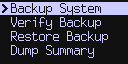

title: Encrypted Backups

## Background

The Coldcard is unique in that we offer a backup feature to save your wallet seeds
to MicroSD card. Settings and other meta is saved as well. The encrypted file can be
treated as any other file because we use AES-256 encryption, with a strong pass phrase.

{.snap .indented}

Even using this feature, you should still have a paper-only copy
of your 24 seed words. Use the encrypted backup feature for convenience
and duplication.

## Creating a Backup

Pick "Backup System" from the menu. Coldcard will pick 12 words as a password. 
These words have nothing to do with your wallet seed and are chosen randomly.

You have to pass a quiz, proving you've written down the words, although we
have made the quiz easier as it does not verify every word.

The new file is written the MicroSD card. If there was already a backup file,
and number is appended to the filename. The most recent backup file should
have the highest number.

!!! warning "Important"

    We strongly recommend using real **Industrial Grade** MicroSD cards for backups:
	At least 2 cards and write 3 times to each card to mitigate future issues.

    You can find them [at the Coinkite store.](https://store.coinkite.com/store/microsd-cc)

	True SLC design with wear-leveling & block management, and 
	environmentaly tested for bend, torque, salt spray, solar radiation, and
	harsh temperatures: -40°C to +85°C.

## Verify a Backup

This command does a quick CRC32 check over the file. It's useful
to check the file was not truncated or damaged in transit. It is
not cryptographically secure, meaning the file maybe artificially
created or deliberately tampered with. However, it's still a useful
feature when you are confident of the chain of custody of your file.

No password is required since the file is not decrypted in this
process.

## Restore Backup

To restore the backup, you must use a new Coldcard with no wallet
defined, or wipe the seed from the Coldcard, which is naturally a
dangerous operation.

## About the Backup File Contents

The file we create is a [standard 7z archive](https://en.wikipedia.org/wiki/7z)
with AES-256 encryption, in CBC mode. The 256-bit key is a SHA256 hash of a passphrase,
hashed in a particular way to support 7z compatibility. We know
the passphrase has at least 128-bits of entropy because the Coldcard
uses it's true random number generator (TRNG) to pick it.

Once decrypted, which is possible using any 7z archive tool, the
contents are a simple text file with everything you could need to
access your funds, in an emergency, using another wallet system.

Restoring the backup file onto a replacement Coldcard is a simple
process that merely requires entering the 12 words.

Your [BIP39 passphrase](passphrase), if defined, is not stored in the backup,
and the backup file contents are not affected by the passphrase.

## Is it secure?

We use AES-256 encryption, wrapped in a [7z archive](https://en.wikipedia.org/wiki/7z).
The passphrase is chosen at random, as 12 words from the BIP39 word list.  This
gives effectively 132 bits of security without any key stretching.
The 7z file format adds a 16-byte salt and random 16-byte IV
(initialization vector), plus a few tens of thousands of rounds of key stretching.
We are not relying on that however, because of the long key itself
(128-bits).

## Proving It Works

Because we are using a standard file format, you can verify the
process and that the data is in fact encrypted. Any 7z tool that
supports AES256-SHA256 encryption should be able to read the files
we make. Take the 12 words and put them together with a single space
between each word (all lowercase). The decoded archive will contain
a single file, `ckcc-backup.txt`, which is a simple text file and
easy to read.

## Primary vs. Secondary

_(Applies to Mk1 and Mk2 only)_

The current wallet, along with data for the corresponding duress
wallet is recorded during the backup. Details of the other wallet
(secondary when using the primary, for example) are not saved. You
should backup primary and secondary wallets individually, but they
can be stored onto the same MicroSD card.

## Limitations

- The archive file names are not encrypted. You can see `ckcc-backup.txt` in
  the hex dump of the encrypted file, encoded as `utf-16-le` bytes.
- The device PIN code is not preserved during backup.
- We produce standards-compliant files, but do not support reading any
  file except the ones produced by Coldcard.
- Do not attempt to edit the file and restore it onto a Coldcard.
- You cannot construct a file for the Coldcard to read because we implement only
  enough to support reading files that we know that we've produced.
- There is no plausible deniability here: the 7z file is clearly a Coldcard backup file.
  But with [BIP39 passphrases](passphrase) in play, even if forced to decrypt your backup,
  there is still one final secret protecting your wallets.
- Learn more about [backup files in our technical paper]({{DOCS}}/backup-files.md).

