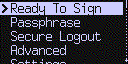

title: Export Deterministic Entropy (BIP-85)
ordering: 101

[_(new in v3.1.4)_](upgrade)

COLDCARD can export "entropy" based mathematically on your COLDCARD's
seed value. This will be displayed as a 12 or 24 word seed phrase,
or formatted in other ways to make it very easy to import into other
wallet systems.

You can easily recreate this value later, based only the
[seed phrase](https://store.coinkite.com/store/seedplate)
or [encrypted backup file](https://coldcardwallet.com/docs/backups) for the COLDCARD.

There is no way to reverse the process, even if the other wallet
system is compromised. As a result, the other wallet is segregated
from the COLDCARD and still fully backed-up.

{.snap .indented}

Read the [BIP-85 (Deterministic Entropy From BIP32 Keychains)](https://github.com/bitcoin/bips/blob/master/bip-0085.mediawiki) for more detail and other applications. 

## How To Use

- Go to Advanced > Derive Entropy

- Choose type of data export needed for target wallet: 12 words / 18 words / 24 words,
  WIF (private key), XPRV (BIP32), or 32/64-bytes hex.

- Enter an "index number" from 0 to 9999. This is anything you wish and allows you
  to do have multiple wallets of the same-type. You should
  probably write down what index number you used, since it is required for restore.

- The seed words, or other value, is shown on-screen. Scroll down to see the details
  for the BIP-85 path used to create the entropy, as well as the raw entropy itself.

- You can stop here, or press (1) to save the screen contents to the MicroSD card.
  (This is somewhat insecure, since it's private key material, but very handy.)

- (Advanced users) Press (2) to make the COLDCARD switch over temporarily to the new key.
  This will allow you to sign PSBT files associated with the derived wallet. The
  key stays in effect until next power down. You will probably need to consult
  [Walletrecovery.org](https://walletsrecovery.org/) in order to build
  specialized PSBT files for recovery purposes.

Thanks go to [Ethan Kosakovsky](ethankosakovsky@protonmail.com) for creating
this useful standard, and for accepting our additions as the standard was being refined.

### Caveats

- You can use this menu item after entering a [BIP-39 passphrase](passphrase). Access
  to the derived entropy will require that same passphrase in the future if you ever
  need to restore it. It's probably better to avoid that.

- If you forget the "index number", it would not be hard to search for the correct value
  because there are only a thousand choices. 

- Derived XPRV or seed words (12/18 or 24) could be used on another Coldcard if you wish.

