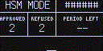

title: CKBunker / HSM Mode
order: 89

[_(new in v3.1.0, requires Mk3)_](upgrade)

# CKBunker and HSM Mode

## CKBunker

CKBunker is a helper program that makes it easy to reach your
Coldcard over the Tor Network, and remotely submit PSBT files for
signing. It also handles setup and configuration of the Coldcard's
HSM features. However, you do not have to use CKBunker to make use
of Coldcard's HSM features, and we expect other helpers programs
to evovlve in time.

Learn more about [CKBunker](https://ckbunker.com) and read it's
docs online, but first it may be helpful to understand Coldcard's
HSM features.

## HSM Mode - Hardware Security Module

"HSM Mode" is the name we use when speaking about the Coldcard signing
transactions without a person physically present. It's an advanced
feature which requires additional software to setup and enable.

HSM mode can be enabled after a "policy file" has been uploaded and
confirmed by the user. That policy file establishes what the Coldcard
will and won't do in HSM mode, and what further authorization steps
may be needed for each spending operation.

Once the Coldcard has gone into "HSM Mode", it must be powered-down
before it can operate normally again.

If a Coldcard has an HSM policy file already installed, you are
given an opportunity to enable it each time the Coldcard is powered,
just after the master PIN is entered and before the USB connection
is enabled. It is also available in the main menu, as "Start HSM Mode".

In HSM Mode, the Coldcard screen looks like this:

{.snap}

No transaction information is shown on the screen, although a
progress bar and one-word description of current activity (ie. "Signing...")
is shown along the bottom of the screen.

!!! warning "Important"

    Your funds in the Coldcard will only be as safe as your HSM
    Policy allows! We recommend a very low velocity (ie. less than
    1BTC/day) and a very limited whitelist of only one or two addresses.

    _Design your policy working from the assumption the attached computer
    may be compromised someday._

### Further Reading

1. [Local Confirmation Codes:](hsm/local-codes) local user interactions at the Coldcard's location.
2. [User Management:](hsm/users) passwords and 2FA codes implemented in Coldcard.
3. [HSM Policy Rules:](hsm/rules) how much can be moved, where, and authorized by whom.
3. [CLI Usage examples:](hsm/cli) for use without the CKBunker.
3. [Security Notes:](hsm/security) understand our security model and related thinking.

