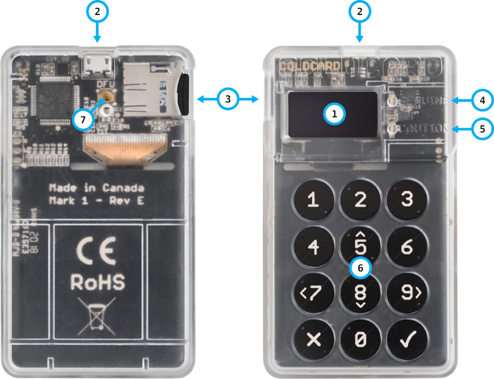

title: Hardware Features
ordering: -1

{.limit-size}

| Callout | Description
|:-------:|:-----------------
1 | Display (128x64 pixels, OLED)
2 | MicroUSB connection to PC.
3 | MicroSD card slot. Push to eject.
4 | Genuine light (Green)
5 | Caution light (Red)
6 | Numeric keypad. Plus X (Cancel/Refuse) and OK (Checkmark/Accept). Arrows keys on 5,7,8,9 for menus.
7 | DFU Button (hole). Not used outside of the factory.

## Micro SD Cards

- Cards up to 32G are supported. Must be FAT formatted (either FAT32 or FAT12)
- For best performance and long life, we recommend our 
  [specialized cards, available on our store](https://store.coinkite.com/store/ckcc), with SLC
  (single level cells) and higher endurance.
- Since our storage needs are very modest, smaller cards are fine.
- We do not guarantee to support all cards ever made, or yet to be made.

## Micro-USB Cable Required

- Use any Micro USB cable to connect to a computer or battery pack.
- We strongly recommend using a battery pack or AC adapter during setup and seed choosing.
- Some battery packs may power down because the Coldcard draws very
  little current, and the pack thinks the attached device is "done charging". It's
  best to avoid these "smarter" battery packs. Wall adapters (AC to USB) work well.

## Genuine / Caution Lights

There are two lights (LED's) marked as Genuine (green) and Caution (red). These lights
are directly connected to the Secure Element of the Coldcard. Their purpose is to
indicate the flash contents have not changed since your last use of the Coldcard.

When you power up the Coldcard, you should see a _Verifying..._ screen and then the
green (genuine) LED will light. This means the flash memory has the correct contents.
There is no way for trojan software to change this light to green without your PIN.

Obviously, the Coldcard from the factory will have a green light,
and after each firmware upgrade, we update the checksum that is
performed so the light will be green again.  The only time you
should see a red light is during a firmware upgrade process (the
first time you enter the PIN after the upgrade), and briefly during
power-up sequence when the verification is on-going.

!!! warning "Important"

    Do not enter your PIN code into what might look like your Coldcard if the
    light is red! You should assume someone has tampered with it's firmware, and it
    might operate normally, but in fact be trying to steal your money.

For more technical background on this security feature
[please have a look at this whitepaper.]({{DOCS}}/pin-entry.md)

## Mark 1 vs. Mark 2 Differences

The Mark2 (Mk2) version of the Coldcard has only one major change: the touch
buttons are replaced by real keys that give a good click!

Minor changes include:

- Better power management & ESD protection.
- Power savings by removing touch keys processing.
- More physical protection on the sensitive traces which connect the secure
  element and main micro.
- Boot rom security improvements: including updates to foil and/or detect MiTM attacks.
- "SHOOT THIS" marker for more effective device destruction.
- Activity LED (green) for MicroSD card slot (left edge).

