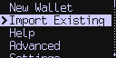
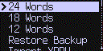
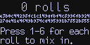

title: Importing or Creating Private Keys
ordering: 83

## Import Existing

If you already have a BIP39 based wallet, or other private key
material, you can import this directly into the Coldcard at setup time.
Choose _Import Existing_ from the main menu.

{.snap}

From the import menu, you can import seed words generated on another system,
restore a backup file, import a raw XPRV or roll a dice to make your own value.

{.snap}

24 Words
18 words
12 Words
: Choose the number of words: 24, 18 or 12 words and the
  following menus will allow you to drill down to appropriate BIP39
  word (English only). The final word is a checksum value that verifies
  the other words.

Restore Backup
: Import a backup file from another Coldcard.
  You will need the backup file (7z) on the MicroSD card, and you must
  enter a 12-word password that was provided at the time the backup
  was created.

Import XPRV
: To import an XPRV, you must provide a cleartext file on MicroSD
  with a BIP32 base58-serialized extended master private key. It
  should start with `xprv` and be on a single line of a text file.
  The reset of the file is ignored. Please note there is no
  encryption for this method, and therefore, it is very hazardous
  and only recommended for testing purposes.

<span id="dice-rolls">_The final item in the menu is a bit different because it allows
you to create the private key directly. In that way it's not really
an 'key import', but a 'create key'._</span>

Dice Rolls
: You have the option of creating a unique seed value by rolling a
  six-sided dice (D6). Just keep pressing 1&ndash;6 as you roll. At least
  99 rolls are required for 256-bit security, and if you operate with
  fewer rolls, you will be warned. Press OK when complete, and the
  equivalent seed words are shown so you can write those down instead
  of the dice numbers. As usual, the word quiz is conducted before the
  seed is saved.

## Mix-in Dice Rolls

This is not the only way to introduce entropy from dice rolls. Any
time the Coldcard is showing the seed words on-screen, you may press
4 to "mix in" additional dice rolls. In this case, since the entropy
of the Coldcard is being used as a starting point, it is safe to
add as few or as many rolls as desired.

Please note that each roll of a D6 dice provides only 2.585 bits
of additional entropy. Therefore, for 128-bit security, which we
consider the absolute minimum, you need 50 rolls, and for 256-bits
of security, 99 rolls. The Coldcard does not limit the number of rolls.

### Technical Background

The first screen always looks like this:

{.snap}

The seed value is calculated as SHA256 over all the rolls, when
expressed as an ASCII string. Therefore, you will always see
`e3b0c... 27ae4... b855` as a starting value, since that's
SHA256 over empty string. You can calculate other values using
Python as follows:

```textfile
>>> from hashlib import sha256
>>> sha256(b'').hexdigest()
'e3b0c44298fc1c149afbf4c8996fb92427ae41e4649b934ca495991b7852b855'
>>> sha256(b'123456').hexdigest()
'8d969eef6ecad3c29a3a629280e686cf0c3f5d5a86aff3ca12020c923adc6c92'
```
