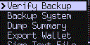
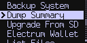
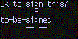

title: MicroSD Card Related

## Background

On the left side of the Coldcard is a slot for a MicroSD card. When needed, the Coldcard
will access the files on that card as a means to interact with the rest of the world,
without using the USB port.

Some features that require a MicroSD card are isolated into the
"MicroSD Card" menu, under the [Advanced Menu](advanced):

{.snap .indented}

## MicroSD Functions

[Verify Backup](backups)
: Quickly checks an existing backup file is complete. Performs CRC check on encrypted file
  and does not require password.

[Backup System](backups)
: Save your wallet seed and settings into an encrypted 7z file.

[Dump Summary](#dump-summary-file)
: Creates a text file with many public details of your wallet. See below.

[Export Wallet](quick#skeleton)
: Creates data file for various wallets so you can import the Coldcard without connecting it
  to USB.

[Sign Text File](#sign-text-file)
: Add a bitcoin signature onto existing file on the MicroSD card.

[Upgrade From SD](upgrade)
: Upgrade the firmware on the Coldcard, using a file found on MicroSD.

List Files
: Show the files on the card. Does not attempt to show them on screen or use the files.

Format Card
: Erase the SD card and build a new filesystem. Does not perform a secure erase.


## Dump Summary File

The "Dump Summary" command can be found here: Advanced > MicroSD > Dump Summary

{.snap .indented}

This command saves a text file to the MicroSD with a summary of the *public details*
of your wallet. For example, this gives the XPUB (extended public key)
that you might need to import into other wallet software to track balance.

By design, this output includes the effects of your [BIP39 passphrase](passphrase) but
does not indicate it is being used.

Here is [an example](static/example-public.txt) of the file produced by Coldcard.

There are sections with derived (public) keys for a number of different wallet systems,
and the first five payment addresses derived for each is shown:

Bitcoin Core
: `m/{account}'/{change}'/{idx}'`

Bitcoin Core (Segregated Witness, P2PKH)
: `m/{account}'/{change}'/{idx}'`

Electrum (not BIP44)
: `m/{change}/{idx}`

BIP44 / Electrum
: `m/44'/0'/{account}'/{change}/{idx}`

BIP49 (P2WPKH-nested-in-P2SH)
: `m/49'/0'/{account}'/{change}/{idx}`

BIP84 (Native Segwit P2PKH)
: `m/84'/0'/{account}'/{change}/{idx}`

Although the subkey derivation will be correct, and we have researched
the BIP32 derivation paths in use by these popular systems, we make
no guarantees about what they are using at present, and some are
configurable.

Do not make deposits to these payment addresses without confirming
they match the wallet in question, and in general, please only use
addresses produced by the wallet which will be responsible for
tracking the UTXO on the blockchain. These can be verified using the 
"Address Explorer", found on the Advanced menu.

## Sign Text File

The "Sign Text File" command can be found here: _Advanced > MicroSD > Sign Text File_

First step is to choose a suitable text file to be signed. It must meet these
requirements:

- have file name extendion TXT
- be less than 500 bytes in size
- filename cannot contain the string '-signed'

The file should contain a single line of text to be signed. If there is a second
line, it specifies the subkey derivation path for the key to be used for signing.
Files that do not meet these requirements will not be offered for signing purposes.

The key subpath is optional and specifies a path from master key, such as
`m/48'/0'/0'` or similar. If not provided, the master key (`m`) is used as a default.

Once a file has been selected, you'll be shown the message to be signed, and
the subpath and address that will be used. You should press OK to proceed,
and a new text file is created and saved with the signature added.

### Message Restrictions

There are restrictions on the message to be signed, including:

- up to 240 characters long
- ASCII only, and no control characters (ie. code points 32 to 127)
- no more than 4 consecutive spaces
- leading and trailing whitespace will be trimmed before signing
- newline characters used in the file are stripped

These restrictions are also applied to messages signed using the USB protocol.

### Example

Here is a full example. Starting with this text file:

```coldstyle
to-be-signed
m/23/23'/33
```

This sequence is shown on the Coldcard:

{.snap}

This creates `signme2-signed.txt` on the MicroSD card:

```coldstyle
-----BEGIN BITCOIN SIGNED MESSAGE-----
to-be-signed
-----BEGIN SIGNATURE-----
1MDhJdtwjtGGbz3vQipUwtgjn5JPT2gWcT
H9JPn0tbPfDVRVC48YnAOwbYKTCFQ5hvimrBAPyRtuzjPxM+hbDCGk+CvtTt/BJrJZkgJi9/UAKyrnbyi0kBsM4=
-----END BITCOIN SIGNED MESSAGE-----
```


