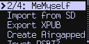
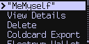
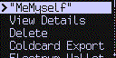
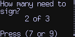

title: Multisig Features
ordering: 85

[_(new in v2.1.0)_](upgrade)


## What is Multisig?

Normal Bitcoin transactions presume a single "owner" of the coins. With Multisig
transactions, there are up to 15 possible owners (signers) and between 1 to 15 of
them are needed to approve any spending.

This is called an M-of-N wallet or "Multisig P2SH" (pay to script hash) wallet.

Starting in version 2.1.0, Coldcard supports M-of-N wallets with up 15 co-signers.
This is an optional feature and does not affect normal "single signer" operations.

Most of the visible changes are related to creation and setup of this new
type of wallet. The transaction approval and signing process is not significantly
affected.

## Setup Your Multisig Wallet

Before the Coldcard can sign transactions involving multiple signatures, it must
learn about the configuration of the wallet and the keys of other co-signers.
The following details are required:

- How many co-signers are there? This is the N value.
- How many are required to approve spends? This is M.
- The Coldcard needs to know the XPUB of all co-signers, to be able display addresses
  and to verify change outputs.
- The XFP (extended fingerprint) of all cosigner keys. In some cases this can be 
  determined from the cosigner's XPUB, but in general it cannot.
- The address format: traditional P2SH, P2WSH (segwit) or P2WSH wrapped in P2SH (transitional)
- Generally, the key derivation path is needed, but this is is somewhat optional.
- A wallet name, limited to 20 characters.

These details can be imported either from a simple text file, or thanks to recent 
changes to [BIP-174](https://github.com/bitcoin/bips/blob/master/bip-0174.mediawiki),
the PSBT file can carry these details.

## Multisig Settings Menu

{.snap}

There is a dedicated menu, "Settings > Multisig Wallets", which lists all established
multisig wallets and contains related functions and settings.

"2/4: MeMyself"
: Your multisig wallets will be listed here by name at the top of the menu. This example
  is a 2-of-4 wallet entitled "MeMyself". Choose the name of your wallet to see more
  details about it, and perform a number of operations. (See next section.)

Import from SD
: Read a new wallet setup file from MicroSD card and import it (details are confirmed).

Export XPUB
: Creates a file on the MicroSD file that has a few possible XPUB keys for this Coldcard.
  The resulting file is used in the next command:

Create Airgapped
: Creates a new multisig wallet based on the contents of the MicroSD. You have a chance
  to pick M value, and see details of the wallet.

Trust PSBT?
: A setting related to how we should treat the data relating to Multisig wallets in PSBT files.

## Setting: Trust PSBT?

This setting controls what the Coldcard does 
with the co-signer public keys (XPUB) that may
be provided inside a PSBT file. There are three choices:

Verify Only
: Do not import the xpubs found, but do
  verify the correct wallet already exists on the Coldcard.

Offer Import
: If it's a new multisig wallet, offer to import
  the details and store them as a new wallet in the Coldcard.

Trust PSBT
: Use the wallet data in the PSBT as a temporary,
  multisig wallet, and do not import it. This permits some
  deniability and additional privacy.

When the XPUB data is not provided in the PSBT, regardless of the
above, we require the appropriate multisig wallet to already exist
on the Coldcard. The default is to 'Offer' unless at least one
multisig wallet already exists, in which case the default becomes 'Verify'.


## Multisig Wallet Detail View

Choose the your existing wallet, by name, from the top of the Multisig menu and you can
view the details about your wallet. Here is an example of the sub-menu shown:

{.snap .indented}

"MeMyself"
: The first line is the name: "MeMyself".

View Details
: Select this to the signing policy, XPUBs, and all other details. It will look
  something like this:

{.snap .indented}

Delete
: Forget this wallet. 

Coldcard Export
: Create the text file other Coldcards would need to work with this wallet.

Electrum Wallet
: Export a skeleton Electrum wallet file to support this wallet.


## Configuration text file for Multisig

The details needed to define a multisig wallet on the Coldcard can be provided
as a simple human-readable text file. The Coldcard can export this file and you
edit it to update values, or it can be exported from Electrum or another Coldcard
involved in the wallet.

Here is an example file:

```textfile
# Coldcard Multisig setup file (exported from 4369050F)
#
Name: MeMyself
Policy: 2 of 4
Derivation: m/45'
Format: P2WSH

D0CFA66B: tpubD9429UXFGCTKJ9NdiNK4rC5...DdP9
8E697B74: tpubD97nVL37v5tWyMf9ofh5rzn...XgSc
BE26B07B: tpubD9ArfXowvGHnuECKdGXVKDM...FxPa
4369050F: tpubD8NXmKsmWp3a3DXhbihAYbY...9C8n
```

- Comments start with `#` and go the end of the line. Blank lines are okay.
- Values and labels are case insensitive.
- All lines are optional, but most users will want to specify the "Policy" and "Name" lines.
- The colon is required.

Here are the values and the expected values:

Name
: Up to 20 characters. Shown on menus and on-screen during transaction approval.

Policy
: Defines M and N values. Can be written "M of N", or just "M/N".

Derivation
: If all xpubs have the same derivation, you may specify it here. Must use single
  quote for hardened keys, and start with "m/" (master).

Format
: Address format. Must be one of these values: `p2sh`, `p2wsh`, or `p2wsh-p2sh`.

XFP (8 digits of hex)
: The fingerprint of the XPUB is used to label it in this file. The rest of the line, after
  the colon is the XPUB for that signer. It should be the XPUB at the derivation path, not
  the master. SLIP-132 format keys can be used, but they will be converted and
  stored in BIP-32 format internally (and in future exports).

All details that can be verified by the Coldcard are checked. For
example, if the XPUB reports a child depth (aka. tree depth) of
one, the XFP provided and the parent key fingerprint need to match.
Generally, it is important the tree depth of the XPUB is accurate
because the derivation paths provided in PSBT files will be masked-out
to that depth. One of the keys provided must have a XFP equal to
the Coldcard's fingerprint, indicating that this Coldcard is one
of the co-signers.

Default values are provided as follows:

Name
: Set to "M-of-N" with M and N filled-in.

Derivation
: Optional, no default provided unless it can be deduced from all XPUBS (depth==1)

Format
: Default: P2SH

Missing XFP
: Calculated when possible, for example if XPUB is derived based on BIP-45 as `m/45'`.

Policy
: Default is M==N. Number of keys as detected in file.

As a result of these defaults, in some very limited cases, it is
possible to just provide the XPUB values. However, if the derivation
is not BIP-45, that will not work as XFP values are required and
there is no way to calculate them from the XPUB itself if it's
child-depth is not one. Name and Policy cannot be edited on the
Coldcard itself, so you will usually want to set those as well.

As the next two sections discuss, you may not need to create this
config file, since you can create a wallet on the Coldcard itself,
using just one MicroSD card, or by using the Electrum plugin to
build the multisig wallet. It's also possible to import a wallet
from a PSBT file.


## Creating a Multisig Wallet using Electrum

_We are awaiting [PR 5540](https://github.com/spesmilo/electrum/pull/5440) to be merged
before Electrum can interoperate with Coldcard._

To create a multisig wallet on Electrum, involving one or more Coldcards, proceed
as follows:

- Choose: "File > New/Restore" from menu.
- Pick a new file.
- Under "Create new wallet", choose: "Multi-signature wallet"
- Use sliders to pick M and N values.
- Under "add cosigner" choose "Use a hardware device" for each co-signer which will be a Coldcard.
- Under "Hardware Keystore" pick your Coldcard. 
- Pick desired address format.
- The "Master Public Key" can be ignored.
- Repeat for all co-signers.

At this point, the wallet should be functional. To sign transactions
or to show addresses, however, the details must be imported into
the Coldcard (or Coldcards), so The final step is to export the
setup file. Use Electrum to create the file by choosing "Wallet >
Information" and then "Export for Coldcard" button. You'll be
prompted for a file name where the text file will be made.

Here is an example:

```textfile
# Exported from Electrum
Name: wallet_3
Policy: 2 of 2
Format: P2WSH-P2SH

# derivation: m/48'/1'/0'/1'
4369050F: Upub5T4XUooQzDXL58NC...8B2fuBvtSa6

# derivation: m
EB5B9686: Upub5TJpKgtw4cBcaAom...GRSP43VHvGm
```

This wallet consists of a Coldcard and a key held by Electrum (a BIP39
Seed in this case) with 2-of-2 signing policy.

Import that file onto the Coldcard using "Settings > Multisig Wallets > Import from SD".
You'll have a chance to view the details of the wallet before accepting it.


## Air-Gapped Creation of a Multisig Wallet

We support air-gapped creation of
multisig wallets, so that you never need to directly
connect the Coldcard to a computer. The steps are as follows:

- Start with an empty MicroSD card.
- Use that same card on each Coldcard involved in the wallet, and choose:
  Settings > Multisig Wallets > Export XPUB. This creates an "ccxp" file 
  which contains various public keys and XFP values.
- On the final Coldcard there is no need to do the export step (but harmless).
  Insert the MicroSD card and choose "Create Airgapped"

```coldstyle
Insert SD card with exported XPUB files
from at least one other Coldcard. A multisig
wallet will be constructed using those
keys and this device.

Default is P2WSH addresses (segwit), but
press (1) for P2WSH-P2SH or (2) for P2SH
(legacy) instead.
```

Press either OK, (1), or (2) based on your preference for address formats, and the next screen
will be similar to this:

{.snap .indent}

Now you may press (7) or (9) to change the M value. The N value (number of keys) is
determined by the number of "ccxp" files found on the MicroSD card.

Press OK, and you'll see the usual preview of the new wallet to be imported.
Confirm that, and the Coldcard will record it and then export two files back
onto the MicroSD: a coldcard multisig wallet config file (for importing
into the other Coldcards involved), and also an electrum skeleton wallet file.

(Both those files can be re-exported later using the various menus on the Coldcard,
if need be.)

At this point, you should return the MicroSD to the other cosigning Coldcards,
and import the multisig wallet into each. You are now ready to sign transactions.


## Notes and Comments

- [BIP39 passwords](passphrase) can be used to create multiple co-signers from a single Coldcard.

- Details of the multisig wallets are saved up as part of the
  normal [encrypted backup.](backups) Multisig wallets can be reconstructed from
  the seed words, but the M-of-N policy and address type must be known.

- [BIP67](https://github.com/bitcoin/bips/blob/master/bip-0067.mediawiki) is used to
  define the ordering of public keys in all redeem scripts. It is an error to provide
  a redeem script in another order. Therefore, it doesn't matter what order the co-signers
  are listed when importing a wallet.

- Due to limited encrypted memory, the Coldcard can only store the details of up to
  eight M-of-3 wallets, or a single M-of-15 wallet. If this is a problem, consider
  using "Trust PSBT" setting.


!!! warning "Electrum Support"

    [PR 5540](https://github.com/spesmilo/electrum/pull/5440)
    has been merged into Electrum to make these multisig features accessible to all.
    You can build Electrum from sources, or wait until the next public version is released.
    We expect these features to be including version 4.0.0 and later.

