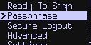
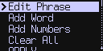
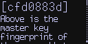
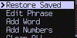
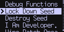

title: BIP39 Passphrase

{.snap}

The [BIP39 standard](https://github.com/bitcoin/bips/blob/master/bip-0039.mediawiki)
supports an optional passphrase which encrypts the
seed words and creates a new wallet (master private key) for every 
possible passphrase. Starting with version 2.0.0 of the Coldcard firmware,
you can select a passphrase to be applied to your seed words. 

The Coldcard never stores your passphrase. You must re-enter it
each time you use the wallet. This improves security and flexibility
because you have the option of using many different passphrases,
each of which may or may not have funds in them.

### Choosing a Passphrase

Thanks to the cryptographic design of BIP39, a weak passphrase does not
weaken the safety of the other wallets or help to reveal the seed words. However,
if an attacker had your seed words, they could exhaustively search for other wallets.
So the usual warnings about using the most complex and longer passphrases does apply.

## Entering the Passphrase

After entering your PIN code and unlocking the Coldcard, it starts with an
empty passphrase. If you don't want to use the new BIP39 encryption features,
you can proceed as you have previously and ignore this feature.

If you do want to use a passphrase, from the main menu of the Coldcard,
choose "Passphrase". A explanation screen is shown with this message:

```coldstyle
You may add a passphrase to your BIP39 seed words.  This creates
an entirely new wallet, for every possible passphrase.

By default, the Coldcard uses an empty string as the passphrase.

On the next menu, you can enter a passphrase by selecting individual
letters, choosing from the word list (recommended), or by typing
numbers.

Please write down the fingerprint of all your wallets, so you can
confirm when you've got the right passphrase. (If you are writing
down the passphrase as well, it's okay to put them together.) There
is no way for the Coldcard to know if your password is correct, and
if you have it wrong, you will be looking at an empty wallet.
```

Press OK (checkmark) to continue to the passphrase entry menu:

{.snap}

The passphrase must be re-entered each time you power up the Coldcard, so we have
a few different ways to enter the value.

1. Edit Phrase
: Enter characters, numbers and symbols by moving up and down and left/right

2. Add Word
: Choose a word from the BIP39 word list (2048 choices &times; 6 variations each)

3. Add Numbers
: Directly enter up to 32 numeric digits using the numpad (very quick)

All three methods can be combined. For example, you could choose the word "Baby"
then add your baby's birthday (8 digits) and then top that off with a few
symbols, such as: `!!!`

You can also start over and clear what you have using the "Clear All" menu item.

## Next Steps

Once you have entered your passphrase, choose "APPLY" from the menu.

{.snap}

The top line shows the fingerprint of the new wallet (extended
master key fingerprint).  It's an 8-digit hex number and it serves
as a good check that you've entered the right passphrase.

!!! positive "Write Down Your Wallet Fingerprint"

    We recommend recording the fingerprint value on paper for later reference.
    It's safe to store that alongside your passphrase if you do commit
    both to paper.

At this point, you can press OK to continue and you will return to
the main Coldcard menu, and the passphrase will be in effect until
you use secure logout or turn off the Coldcard.

Press X to go back and adjust your passphrase if the fingerprint is not what you expected.

[_(new in 3.1.3)_](upgrade)

Press (1) to save your new passphrase onto a MicroSD card at this point. Your
passphrase value
will be encrypted and preserved on the card for next time. To make use of the passphrase,
just have the same MicroSD card inserted when you go into the _Passphrase_ menu. There will
be a new menu item at the top, _Restore Saved_ and if you pick that, a menu is shown with
your saved values:

{.snap}

For security reasons, only a few letters will be shown; just enough to differentiate
between your passphrases, if you know them already. Pick the one you want, and press OK.
There are no more steps; the new value is in effect.


### Using Coldcard with a BIP39 Passphrase

- All features operate the same as normal after the passphrase is used.

- Your passphrase is not validated in any way. If you enter an incorrect phrase, you
  will not find your Bitcoin! Expect zero balances in that case.

- [Backup files](backups) do not contain the passphrase, and they capture the original
  seed and not the extended private key created by the passphrase.

- Passphrases are limited to 100 characters in length. The on-screen interface supports
  ASCII characters only (effectively English only, with no accented characters).

- Please do not start Electrum or open your desktop wallet file
  before entering your passphrase. If you do, you may get errors as
  it will start with your default wallet (empty passphrase) and not
  the one you want.  If you create a skeleton Electrum wallet, you
  should do it after entering the passphrase of the new wallet.

- PSBT files contain a reference the wallet fingerprint so you will get helpful errors
  if you try to sign a PSBT using the wrong passphrase. The correct fingerprint
  is shown in the error message.

- You can see the fingerprint of your current wallet using the "View Identity" menu item
  on the Advanced menu.

- It is possible to import an XPRV or master secret (bytes) and operate Coldcard without
  any seed words. Such a system cannot use BIP39 passphrases and so this menu item will not
  be visible.

- The passphrase can be sent to the Coldcard over our encrypted USB protocol, using our
  [command line tool: ckcc](cli). You must
  confirm it on the Coldcard, but this can be handy way to enter complex passphrases
  assuming you trust the desktop computer and any keyloggers present there.

- Passphrases may be used an alternative to the "duress PIN" feature, and it is more
  powerful because there are an unlimited number of possible wallets.

- Saved passphrase values can be found in the file `/.tmp.tmp` on the MicroSD card, if
  you have chosen to save them. They are encrypted with AES-256 (CTR mode) with a key
  derived from the master secret (seed words) and a hash of the MicroSD's unique
  serial number. For this reason, you cannot copy the encrypted file to another card.


## Related Feature: Lock Down Seed

Your 24 seed words combined with a passphrase, represent a full
BIP32 HD-wallet. Normally, you
would unlock the seed words based on the PIN code, and then enter
the passphrase to get to the "real" wallet.

But we can store that result of those steps as the secret protected
by the PIN. Doing so replaces the seed words with the newly
calculated master private key (XPRV = extended master private key),
and that secret includes the passphrase (securely&mdash;it is not reversible).

This option is available under: Advanced > Danger Zone > Lock Down Seed

{.snap}

When you choose that option, you will see a confirmation message, as follows:

```coldstyle
This operation computes the extended master private key using your
BIP39 seed words and passphrase, and then saves the resulting value
(xprv) as the wallet secret.

The seed words themselves are erased forever, but effectively there
is no other change. If a BIP39 passphrase is currently in effect,
its value is captured during this process and will be 'in effect'
going forward, but the passphrase itself is erased and unrecoverable.
The resulting wallet cannot be used with any other passphrase.

A reboot is part of this process. PIN code, and funds are not affected.
```

After confirmation, the process starts and the system reboots. You should 
enter your PIN and confirm the new system has the correct fingerprint.
The menu option to enter BIP39 passphrase will no longer shown.

!!! warning "Seed Words Are Destroyed"

    This command replaces the seed words inside the secure element.
    There is no way to recover the original seed words, nor the passphrase.

Backup files created going forward from this point will show an
XPRV (extended private key) as the root secret. The seed words are
no longer known to the Coldcard and so do not appear in the backup
file.

### Why Use This?

- If you tire of entering the passphrase everyday... this frees you of that burden.

- You might create a few wallets, all based on the same seed words, but
  different passphrases for delegation to other people. You can protect the confidentially
  of the seed words, and load a number of Coldcards with the same seed words and
  different passphrases each. This is done easily by restoring the same backup file
  into each new Coldcard, entering a distinct passphrase, and "locking down" the seed.

- Another way to look at this feature is to think of it as converting your
  [BIP39 wallet](https://github.com/bitcoin/bips/blob/master/bip-0039.mediawiki)
  into an [BIP32 wallet](https://github.com/bitcoin/bips/blob/master/bip-0032.mediawiki).

