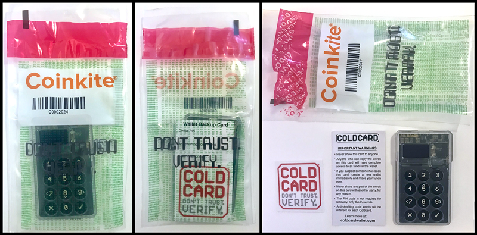
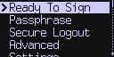
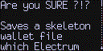
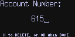

title: Quickstart! Start Here!
ordering: -10

## About the Bag

Your coldcard should have arrived sealed in a special bag: It
has a large Coinkite logo, green text and a barcode with number
underneath. This number is important and we call it the "bag number".
Please make note of this number because the Coinkite factory has recorded
this number into the secure area of flash memory of your Coldcard.

Before opening it yourself, please inspect the bag for damage or
signs of being previously opened. After you open the red seal, it
will show the word "VOID".  If you find anything out of place,
please contact <support@coinkite.com> with photos.

The purpose of the bag, and it's unique number, is to give you
confidence that the Coldcard has come directly from the factory and
has not been modified by anyone before you get started.

This is merely one of many layers of our security, and we know that
plastic bags can be "hacked" with sharp knives and so on. This is an
example of "Defense in Depth".

{.limit-size}

## Power Up

Connect a power supply to the Coldcard using the USB port at the top.
Any Micro USB cable you already have can be used. You can connect
the USB to a computer, but at this stage, a wall charger or USB 
power pack could also be used. We just need power, not data.

## Terms of Sale

The first screen you will see looks like this:

{.snap}

If you look closely at the right edge, there is a small
scroll bar and arrow pointing downwards. Use the 5 and 8 keys
to move up and down and see the full message. 

The complete terms document [can be found here.](/legal)
Press the OK key (checkmark, lower right) to accept the terms
and continue. 

<h2 id="initial-pin">Initial PIN</h2>

Before a Bitcoin seed is generated, you must select a
primary PIN. This is your main defence against random
people using your Coldcard when you are not around.
Please pick good PIN codes!

On the Coldcard, the PIN consists of two parts, like these examples:

    12-34
    1234-5678
    872323-39843
    12-345678

The first part is called
the prefix (1234-) and the second, the suffix (-4567).
Each part must have between 2 and 6 digits. 
The prefix
determines the anti-phishing words you will see each time you login.

When you pick your PIN code, you'll see the anti-phishing words associated
with the PIN prefix. These words will be unique for each Coldcard. 
You may want to experiment with a few different PIN prefixes until you
find some fun or memorable words. Regardless, you will need to remember
those words, as it's important to verify those words before proceeding to
the second part of the PIN—every time you login to the Coldcard.

As usual, you will be asked to confirm the new PIN and enter it a second time.

!!! negative "Important"

    No-one can help you if you forget your PIN. There is no back door, hints
    or alternative ways into the Coldcard.

!!! warning "Use Longer PIN"

    We strongly recommend using "four plus four" digits in your PIN: `1234-5678`
     Having just "two plus two" is permitted, but might allow brute force attacks.

## New Wallet or Import

Once your PIN has been established, it's time to setup your wallet.
You should see a menu like this:

{.snap}

If you already have a BIP39 seed, or a backup from another Coldcard,
or even a XPRV (extended private key), you should choose [_Import Existing_](import)
menu item. However, most new users will start with _New Wallet_.

## New Seed (New Wallet)

Choose _New Wallet_ to generate 24 words using the BIP39 word list.

The words are then shown to you. Write down the seed words, in
order, on the provided card or some other paper. Please be careful
at this stage and make 100% certain that each word is recorded correctly.
You might want to duplicate them by hand at this point too (ie.
make a backup copy).

Once you've written the words down, press OK to continue to the
quiz.  The Coldcard will ask you what each word is, in random order.
We do this to verify your backup copy is correct. If at any point
you are unsure of a word, you may see them again by pressing OK.

If you complete the quiz successfully, the words are saved, your new
Coldcard is ready to be used.

!!! negative "Important Warning"

    It is critical to write down the wallet seed. Do not use this product
    without the seed written down and stored safely offline. Do not save
    the wallet seed onto a computer or mobile phone. Do not take a picture
    of the seed words with anything other than a chemical camera.

# Passphrase (BIP39)

If you want to use a [BIP39 passphrase](passphrase) you can enter
it at this point to switch to that wallet. Remember to do this every
time you want to access the wallet under that passphrase.

# Ready to Sign!

Once your PIN code and master seed have been established, your
Coldcard is ready for daily operation. You should see a menu like this one:

{.snap}

If the USB port is connected to a computer, the Coldcard makes
itself available to that computer. (The Coldcard is invisible to
the attached computer, if any, until the PIN code is correctly
entered.) You can use a desktop wallet, such as Electrum, to pair
with the Coldcard and then send it transactions to be signed.

Alternatively, you can use a MicroSD card to bring in transactions
and sign them. 

## Using with Electrum via USB

- install Electrum version 3.2.3 or later, with Coldcard support: [download here](https://electrum.org/#download)
- select "New/Restore" from File menu
- pick file name
- pick "Standard Wallet"
- pick "Use a hardware device"
- select the Coldcard device shown
- choose Segwit or classic address format
- operates like any other USB hardware wallet

## Using Coldcard Offline { #skeleton}

Steps (for Electrum):

- secure quality MicroSD cards of small size
- on the Coldcard, go to: _Advanced > MicroSD Card > Export Wallet > Electrum Wallet_
- read and approve the warning message, like this:

{.snap .indented}

- a new file, `new-wallet.json`, is written to the MicroSD
- remove card, take to a computer running Electrum
- your Electrum client must have the Coldcard plugin enabled
- open the wallet file, and wait for sync to complete.
- you may want to keep the wallet file (which now has many additional details
  about change addresses and so on) elsewhere on your computer.

When you want to spend from this wallet:

- open the wallet in Electrum
- setup your new transaction as usual
- choose Preview transaction, then the "Save PSBT" button
- you can save directly to your MicroSD card.
- use a short file name that describes transaction or has the date; must end in `.PSBT`
- move that card to the Coldcard
- select "Ready to Sign" from main menu of the Coldcard
- pick today's PSBT file from the list (if there is more than one on the card)
- approve the details of the transaction
- the resulting transaction will be saved back to the card, under the same filename with new
    ending: `-final.txn`
- use any copy of Electrum, or a public service to push the hex-encoded transaction from that file
- for example, in Electrum, use Tools > Load transaction > From file

We support creating 'skeleton' wallet files for these systems:

- [Bitcoin Core](https://bitcoin.org/en/download)
- [Electrum](https://electrum.org)
- [Wasabi](https://wasabiwallet.io)

### Multiple Accounts

_(new in v3.1.1)_

When exporting files for Bitcoin Core or Electrum, you may now press "1" at the
confirmation screen, and then enter an arbitrary "account number" on the Coldcard.
That account number is put as the last hardened component of the derivation path for
the wallet's keys. 

{.snap .indented}

In this example, if a segwit-style wallet was made, the full derivation
path of the first address (non-change) would be:

    m/84'/1'/615'/0/0

Note the `615'` in the the path. By default, account number is zero.

# What's Next

Keep your Coldcard in a safe location. Every time you remove it from storage and use it,
please consider the following:

- Are there scratches on the case?
- Is the light green or red? It should be green!
- Are the anti-phishing words correct? Do **not** enter the rest of your PIN if you
  are unsure.

