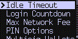
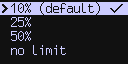
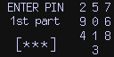
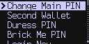
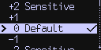

title: Settings Menu
ordering: 10

The settings menu, contains a number of items which are essentially preferences.

{.snap}

## Idle Timeout

Most people will use the Coldcard very briefly to authorize a
transaction and put it away. They are not typically used for long.
Therefore, we provide an "idle timeout" feature, set to a default
time of four hours. You may change this to a number of different
values between two minutes and eight hours, or disable the idle
auto-logout function completely.

## Login Countdown

As a defensive measure, the "login countdown" can force
a time delay when logging into the Coldcard.
Once enabled, you must enter you PIN correctly, and then wait out
a forced delay (of minutes/hours/days) while a count down is shown
on-screen.  Then enter your PIN correctly, a second time, to get in.

You can choose between 5/15/30 minutes, 1/2/4/8/12 hours, and
1/2/3/7/28 days. You must provide continuous power to the Coldcard
during the entire period, so plan ahead and consider using an AC
power source, charging a battery pack, or a UPS system.

!!! positive "Countdown Limitation"

    Unlike most of our security features, this login delay is not
    imposed by the secure element.  This means it may be possible
    to bypass the delay by opening the plastic case and interacting
    directly with the hardware. We still consider it a useful addition
    against $5 dollar wrench attacks, as physical attackers are not
    necessarily as technical.

## Max Network Fee

The transaction is being signed by Coldcard typically includes a
small "network fee" that goes to the miner who includes your transaction
into a block. Normally, this fee is a tiny
amount compared the the value of transaction, so the Coldcard will
always warn if it exceeds 1% of the output value. There is also a
hard limit on the fee, which defaults to 10%. If that threshold is
exceeded, Coldcard will refuse to sign the transaction.

{.snap}

Using this new setting, you can change or remove that percentage
fee limit.  The 1% warning is still shown, but you will be able to
approve the transaction as normal.

## Multisig Wallets

This sub-menu allows you to manage the [multisig wallets](multisig)
known to the Coldcard.

## Set Nickname

You can give your Coldcard a personalized name. Once set, it will
show this name immediately on power-up. No PIN is needed. Just press
any key to proceed to the normal login process.

## Scramble Keypad

If this is enabled, when entering PIN, the order of the key numbers
are randomized, so that cameras and shoulder-surfers are defeated.

{.snap}

## Blockchain

From this menu, choose which blockchain to use. This does not affect
your seed or master private key, but it does affect how we show
payment addresses. Only developers and other users of TestNet will need this.

## Change PIN Code

{.snap}

### Duress Wallets

The duress wallet is intended as a personal safety feature: you
should put money you are willing to lose into the duress wallet,
and should you even be forced to reveal a PIN, you may provide the
duress PIN in place of the "real" PIN. The Coldcard operates as
normal when unlocked by the duress PIN code so that your attackers
are not alerted. However, if they are technical enough, there are
ways to detect the difference.

[Start here](https://github.com/Coldcard/firmware/blob/master/docs/pin-entry.md#recovery-of-funds-from-duress-wallet) to learn more about the technical details.

### Brickme PIN

There is also a PIN number which we call the "brickme PIN". If that
PIN code is used at any prompt, the Coldcard destroys itself. It
becomes a useless brick. All the secrets are destroyed.

Please be careful with the brickme PIN. The destruction process is
quick and irreversible. The Coldcard should be discarded as e-waste
and cannot be reused.

## Forgotten PIN Code

If you've forgotten your PIN, we cannot help you. Even if you gave
us the Coldcard, and we put all our resources into it, we cannot
crack or break the Coldcard to get the seed out without the PIN.
Our design uses a specialized key storage chip and your wallet
secret (seed) is effectively encrypted by the PIN and held in that chip.

# Obsolete Settings

## Touch Setting (Mk1 only)

The number pad uses capacitive touch technology. From this setting menu, you
may adjust the sensitivity of the touch. In warm or humid environments,
or in cases where you see "phantom presses", choose "-2 Sensitive" (least sensitive).
For the impatient, there is "+2 Sensitive" which feels more responsive and "quick".

{.snap}

The latest version of the firmware includes as many as five different
levels of sensitivity. Please note that less-sensitive modes are a
little slower to respond to your touch.

_(new in v1.1.0, removed on Mk2 hardware)_

## Secondary Wallets (Mk1, Mk2 only)

In earlier makes of the Coldcard, there was a concept of a "secondary"
wallet, that had most of the features of the main wallet, but an
independany PIN code and seed phrase. Due to hardware limitations
and security-related changes, this was removed in the Mk3 Coldcard.

_(removed after Mk2)_

