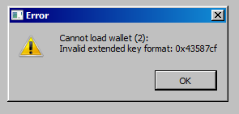

title: Trouble Shooting
ordering: 99

### My valid PSBT file produces warning "Troublesome Change Outs"

The Coldcard will analyze paths used for change outputs and show a warning if they
are not similar in structure to the inputs of that same transaction in the PSBT file.

These are imperfect heuristics and if you receive a false positive, or are doing
weird things that don't suit the rules below, please send an example PSBT to
support and we'll see if we can handle it better.

The Coldcard (as of v3.0.2) will check:

- same derivation path length
- shared pattern of hardened/not path components
- 2nd-last position is one or zero (change/not change convention)
- last position within 200 units of highest value observed on inputs

If your PSBT file does not match this, you will get a "Troublesome
Change Outs" warning during the approval process. The expected and
actual values observed will be shown on-screen, and you may approve
the transaction if you wish.

### My PIN isn't always accepted (Mk1 and Mk2 only)

If the second part of your pin starts with a "2", you might be doing
that digit at the phishing words screen. That sends you into the
"secondary" PIN, although you are trying to enter the main one.
Instead, please be careful to press OK at that screen, then "2".

### Electrum says 'Cannot load wallet'

Maybe you get this warning screen:

The `0x43587cf` might also be `0x48821e`.

This error means that you are trying to use a Coldcard set for test
net vs. an Electrum that is working on main net (or vice versa).
They need to be set the same. Start Electrum with a `--testnet`
flag and/or change the blockchain on the Coldcard settings to match.

### Touch pad is not doing what I want (Mark1 only)

Phantom keypresses have been a problem for some users. Here are some
debug steps:

1. Install [version 1.0.1](upgrade) or later of the firmware.
2. Change the [touch setting](settings) to suit your preferences and needs.
3. Press X twice before entering PIN; that selects the least sensitive mode.
4. Use a quality USB power supply. Often a battery pack is best for this.
5. Move to a different environment. Moisture in the air can be an issue.

One customer reported this:

_I did some testing and it seemed that any computer plugged to the grid is plagued by noise, 
after connecting the wallet to an offline laptop running on battery power, I had zero issues with the touchpad._

### Light is RED after a firmware upgrade?

This can happen normally during the upgrade process and isn't a cause for 
concern, as long as you are one doing the upgrade and have maintained
physical possession of the device during the process. You
can [reset the light to green](upgrade#bless-firmware) easily.

## See also the FAQ

The [Coldcard FAQ](/faq) may also have the answer to your question.

## Got more?

If you run into trouble using the Coldcard, please drop a
note to <support@coinkite.com> so we can add your knowledge and experience 
to this page!
