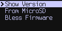

title: Upgrade Firmware

<em><a href="#upgradenow" >Learn how to upgrade here ></a></em>

## Current Version of Coldcard Firmware &mdash; Version 3.1.5

[2020-06-13T1928-v3.1.5-coldcard.dfu](https://github.com/Coldcard/firmware/raw/master/releases/2020-06-13T1928-v3.1.5-coldcard.dfu) released June 13, 2020.

_**NOTE**: Releases 3.1.0 and later are NOT COMPATIBLE with Mk1 hardware. They will brick Mk1 Coldcards._

{{ vidlink("How to Upgrade Firmware", "https://www.youtube.com/watch?v=RYcB5HpfcaE&list=PLZKkuPrgFw0axLoDDzxAIYzpZeC_T1i7W&index=3") }}

## Version 3.1.5 - June 13, 2020

- Enhancement: Detect, report and block the recently reported type of attack
  against BIP-143 (replay of segwit inputs) with an error message. No changes
  needed to your input PBST files. Will show errors similar to:
  "Input#0: Expected 15 but PSBT claims 5.00001 BTC"
- Enhancement: When the Coldcard is finalizing the transaction, we show the TXID (hex
  transaction ID) of the transaction on the screen. 
- Enhancement: Export deterministically-derived entropy in the form of
  seed phrases (BIP39), XPRV, private key (WIF), or hex digits using new BIP-85 standard.
  Useful for seeding other wallets from your Coldcard, so you don't need to backup
  "yet another" seed phrase. Derived values (all types) can be easly recreated from
  Coldcard later, or the backup of the Coldcard. Does not expose the Coldcard's master
  secret, should new wallet be compromised.
- Bugfix: When scrambled keypad used with the login delay feature, the PIN-entry sequence
  was not scrambled after the forced delay was complete. Thanks to an anon customer
  for reporting this.
- Bugfix: Scrambled keypad didn't change between PIN prefix and suffix.
- Enhancement: QR Code rendering improved. Should be more readable in more cases. Faster.
- Enhancement: View percent consumed of the settings flash space (just for debug)
- Enhancement: New command to clear the UTXO history, in rare case of false positive.
- (v3.1.5) Bugfix: Signing PSBT with finalization from MicroSD card, did not work. Error about
  "HexWriter" was shown.

## Version 3.1.3 - April 30, 2020

- Enhancement: Save your BIP39 passphrases, encrypted, onto a specific SDCard, if desired.
  Passphrases are encrypted with AES-256 (CTR mode) using a key derived from the master
  secret and hash of the serial number of the SDCard. You cannot copy the file to
  another card. To use this feature, press (1) after you've successfully entered your
  passphrase. 'Restore Saved' menu item will appear at top of passphrase-entry menu,
  when correctly-encrypted file is detected.
- Enhancement: Export a generic JSON skeleton file, not aligned with any particular
  desktop/mobile wallet, but useful for any such integrations. Includes XPUB (and
  associated data) needed for P2PKH, P2WPKH (segwit) and P2WPKH-P2SH wallets, which
  conform to BIP44, BIP84, and BIP49 respectively.
  Thanks to [@craigraw](https://twitter.com/craigraw) the idea.
- Enhancement: when signing a text file from MicroSD card, if you specify a derivation
  path that starts with `m/84'/...` indicating that you are following BIP84 for
  segwit addresses, the resulting signature will be formatted as P2WPKH in Bech32.
- Minor code cleanups and optimizations.

Older releases and their changes [are listed here](version-history),
the full source code, hardware details, and much more can be found
in [our repository on github](https://github.com/Coldcard/firmware/tree/master/releases).

## Mark 1 Hardware (late 2017 / early 2018)

The Mk1 hardware is obsolete and no further updates will be made. The final
version of firmware for the Mk1 is
[3.0.6 (2019-12-19T1623-v3.0.6)](https://github.com/Coldcard/firmware/raw/master/releases/2019-12-19T1623-v3.0.6-coldcard.dfu). Do not load any newer firmware version,
as it will brick the device.

---

# How To Upgrade { #upgradenow }

## Upgrading Step By Step

{{ vidlink("How to Verify COLDCARD's Firmware", "https://www.youtube.com/watch?v=RYcB5HpfcaE&list=PLZKkuPrgFw0axLoDDzxAIYzpZeC_T1i7W&index=3") }}

1. Download and verify the [latest firmware release](https://github.com/Coldcard/firmware/raw/master/releases).
2. Save the `20...-coldcard.dfu` firmware file onto a SD card.
4. Power up your ColdCard and unlock it with your PIN.
5. Go to the `Advanced > Upgrade` menu and click on `From SD Card`. 
6. After the confirmation dialog, ColdCard will upgrade and reboot (slow).
7. Type in your PIN again. Verify new version running with: 
   `Advanced > Upgrade > Show Version`
8. If you powered down during this process, to get a green light again,
   you may need to use: `Bless Firmware` in that menu.

## Advanced: Verify Your Downloads

The release binaries may be verified using
[this clear-signed text file](https://raw.githubusercontent.com/Coldcard/firmware/master/releases/signatures.txt)
and GPG. The commands are:

    curl https://keyserver.ubuntu.com/pks/lookup?op=get&search=0xA3A31BAD5A2A5B10 | gpg --import
    gpg --verify signatures.txt

The first command imports the public key [`4589779ADFC14F3327534EA8A3A31BAD5A2A5B10`](https://keyserver.ubuntu.com/pks/lookup?op=get&search=0xA3A31BAD5A2A5B10) and the second verifies the file's
signature vs. file contents.

Don't forget to run SHA256 over the DFU files themselves, because that compares
the actual file contents to what we have signed.

    sha256sum 2019-12-19T1623-v3.0.6-coldcard.dfu

Github.com is also protecting us because it verifies on all commits
against the developer's public keys, and keeps a history of changes.

---

## Background

The upgrade menu allows you to load updated firmware onto the Coldcard.

{.snap .indented}

The menu allows loading an upgrade file from a MicroSD card, but it can 
also be done using the [command line tool](cli), or from the Electrum plugin.

## How to Upgrade

Show Version
: Displays the version numbers that you have already.

From MicroSD
: Select an upgrade file from MicroSD card and start the process.

Bless Firmware
: Mark the contents of flash memory as "approved" and light the green "Genuine" light.

## Upgrade Files

You need a `DFU` file for upgrades. It's about 690k in size and should have the
extension `.dfu`.

The latest firmware will always be available in Github:

[github.com/Coldcard/.../releases]({{RELEASES}}){.indented}

All upgrade files must be signed by a Coinkite Inc. approved key, or
the Coldcard will refuse to load and run them.

## Bless Firmware

This command is not typically needed, but can be used to set the
genuine/caution lights to green. Note that only the main PIN holder
can do this. A normal firmware upgrade sequence does not require
this action, but if the unit is powered down between installing the
upgrade and the first successful login, then the light will be red,
and will stay red until this command is used.

## Downgrade Protection

In general, it may not be advisable to downgrade (return to an older
release). Some releases will set a "high water mark" so the bootloader
that will block any downgrade to earlier versions. We will do this
if a bug or security problem with an obsolete release is identifed.

## Need extra help?

Watch this [Video: Secure Upgrade Firmware of ColdCard Mark 2 - Max Hillebrand](https://www.youtube.com/watch?v=JCZzugnfQPs)

